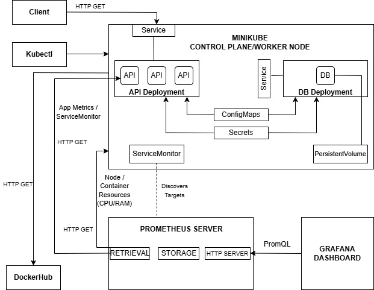
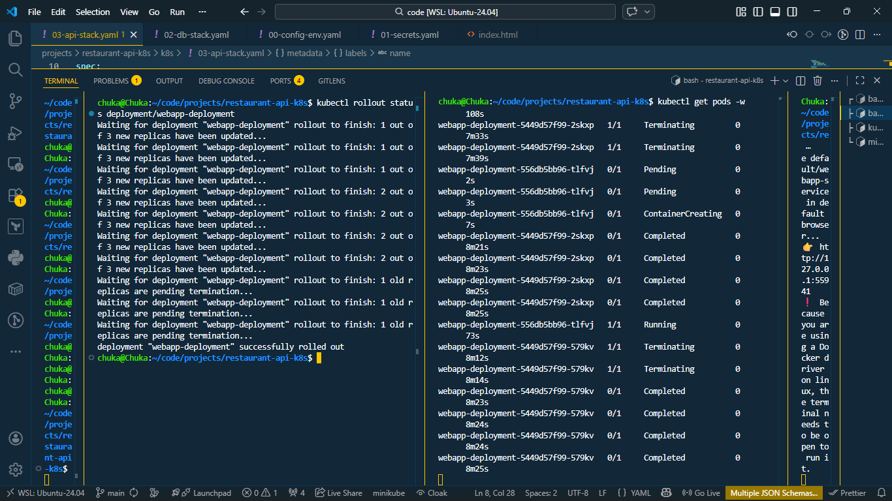
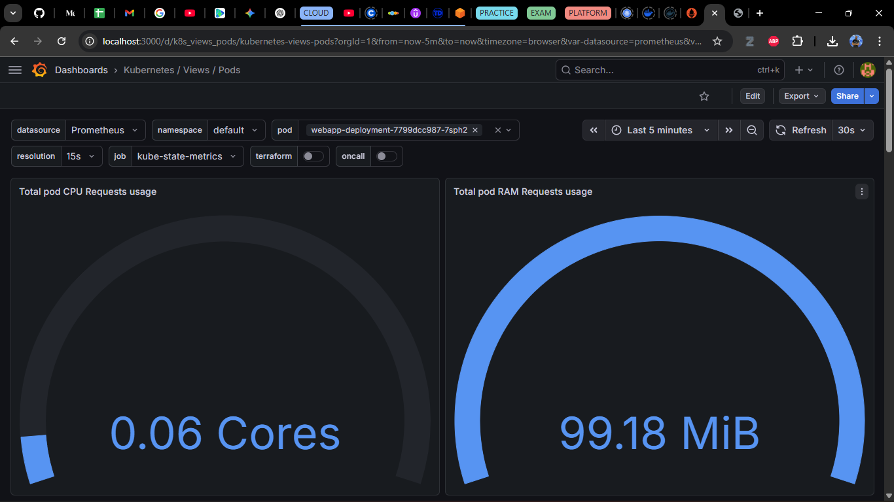
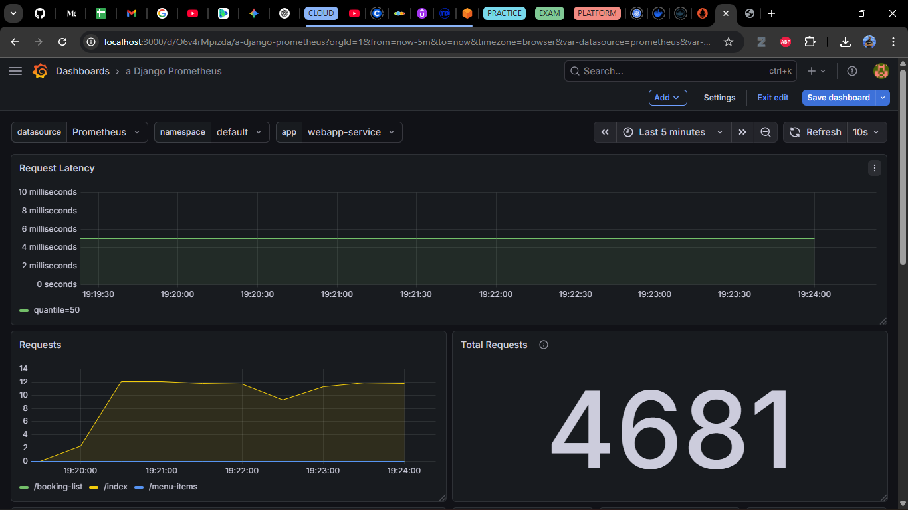

**Local Kubernetes Orchestration & Observability**  
Automated deployment of a Django/MySQL stack on Minikube with integrated Prometheus/Grafana metrics. This is version 2 of a continuously evolving cloud-native system. 

**Project Scope**  
This project focuses on local container orchestration and metrics-only observability using Minikube, Kubernetes, Docker, Prometheus, and Grafana. Cloud-native services (Terraform, EKS, IAM, Secrets Manager, CloudWatch, etc) are explored in later iterations.

**Installation & Setup**  
Follow these steps to deploy the AsgardCuisines API and its observability stack to a local Kubernetes cluster.

 1. Prerequisites  
  - Minikube: Local Kubernetes cluster.  
  - kubectl: Kubernetes command-line tool.  
  - Helm: For managing the Prometheus/Grafana monitoring stack.  
  - Docker Desktop: (Running as the driver for Minikube).  

 2. Clone the Repository  

```bash  
git clone https://github.com/ChukaOkeke/restaurant-api-k8s.git
cd restaurant-api-k8s  
```

 3. Cluster Initialization  
  Start your local cluster  

```bash  
minkube start --driver=docker 
```  

 4. Secrets Management  
 Kubernetes Secrets require values to be Base64-encoded. Prepare the file and replace placeholders strings with your values

```bash  
cp secrets.yaml.example k8s/01-secrets.yaml 
``` 

 5. Deploy the Application  
  Apply the Kubernetes manifests in the right order to ensure dependencies are ready first. The manifests are properly ordered to allow for a single apply.

```bash  
kubectl apply -f k8s/ 
``` 

 6. Set Up Observability (Prometheus & Grafana)  
  Deploy the monitoring stack and import your "Dashboard as Code" JSON:
   1) Install the Stack:  

```bash  
helm repo add prometheus-community https://prometheus-community.github.io/helm-charts
helm repo update
helm install monitoring prometheus-community/kube-prometheus-stack --namespace monitoring --create-namespace 
``` 
   
   2) Import Dashboard:  
    - Get Grafana password:  

```bash  
kubectl get secret --namespace monitoring monitoring-grafana -o jsonpath="{.data.admin-password}" | base64 --decode ; echo
``` 

    - Access Grafana via port-forwarding:  

```bash     
kubectl port-forward svc/monitoring-grafana 3000:80 -n monitoring
```

    - Log in at http://localhost:3000/ using admin as username and the obtained password.  
    - Import the JSON files located in monitoring/dashboards/k8s-pod-resources.json and django-app-metrics.json

 7. Access the application  
  To reach the API from your browser, get the API service endpoint 

```bash     
minikube service webapp-service
```  
The API will be available at http://minikube-ip:31000/api/ or http://localhost:minikube-service-port/api/ (in the case of Minikube tunneling)

 8. Verify with Load Testing
  Simulate traffic to see live metrics in your Grafana dashboard:

```bash     
while true; do curl -s api-service-endpoint/api/ > /dev/null; sleep 0.1; done
```  

**1. Problem & Constraints**  
 **Problem Statement**  
 The goal was to architect, orchestrate, and monitor a secure, scalable backend API for restaurant bookings and menu management that could evolve from Minikube/Kubernetes, and later to cloud-native services.  

 **Constraints**  
 - Cost-efficient local container orchestration
 - Secure handling of secrets
 - Container portability
 - Clear separation of services
 - Metrics-only observability 


**2. Architecture Overview**  
 **System Architecture Diagram**     

   
 

 **Component responsibilities**  
 - Minikube Control Plane/Worker Node: The locally-provisioned single-node Kubernetes cluster, acting as both the Control Plane and Worker Node.
 - API Deployment - The Kubernetes deployment that manages the Django API pods.
 - DB Deployment - The Kubernetes deployment that manages the MySQL database pod. 
 - Service - Assigns a stable IP address to the ephemeral pods for reliable communication.
 - ConfigMaps - External non-sensitive configuration data for the application.
 - Secrets - For storing sensitive configuration data (like database credentials) for the application, in base-64 encoded format.
 - PersistentVolume - For data persistence, to avoid losing database data when container restarts.
 - ServiceMonitor - Points Prometheus to the target service.
 - Kubectl - For interacting with the Kubernetes cluster via CLI
 - DockerHub - Online registry for storing and pulling Docker images.
 - Prometheus Server - For collecting, storing, and exporting numerical metrics from targets.
 - Grafana Dashboard - For visualizing metrics.
 - Client - Sends HTTP requests to the API service.  

 **Trust boundaries**  
 **Trust Boundary 1: External Traffic -> Service (Cluster Entry)**  
 - All external traffic is routed through a defined entry point (Service) rather than direct pod access.
 - Requests are load-balanced across the Django API pods, ensuring no single pod is directly exposed to the host network.
 - Traffic is restricted to specific ports (e.g., 8000), blocking unauthorized administrative access to the container runtime.

**Trust Boundary 2: API -> Database (Namespace Isolation)**  
- The MySQL database is strictly internal-only and lacks a Public IP or external LoadBalancer.
- Communication is restricted to the cluster's internal DNS (e.g., mysql-service.default.svc.cluster.local).
- Network Policy Readiness: Though running locally, the architecture is designed to support Pod-to-Pod encryption and network policies.

**Trust Boundary 3: Secrets Management (ETCD & Pod Injection)**  
- Sensitive credentials (DB passwords, API keys) are managed via Kubernetes Secrets rather than plain-text .env files.
- Secrets are injected into containers as environment variables at runtime, ensuring they never persist in the container image or version control.
- Access to the secrets.yaml is restricted via local file-system permissions, with only a secrets.yaml.example pushed to GitHub.

**Trust Boundary 4: Observability Loop (Prometheus -> Targets)**  
- Prometheus Server acts as a trusted internal auditor, initiating "Pull" requests to scrape metrics.
- ServiceMonitors define the strict scope of what Prometheus can see, preventing the monitoring stack from probing unauthorized pods.
- Metrics endpoints (e.g., /metrics) are typically bound to the internal cluster network, ensuring performance data isn't leaked to the public internet.


**3. Key Design Decisions & Trade-offs**  
- Chose Kubernetes (Minikube) over Docker Compose for orchestration to simulate a production-grade environment, enabling features like self-healing, rolling updates, and automated service discovery that are essential for scaling.
- Chose Helm to manage the complex deployment of the Prometheus ecosystem; this allowed for a standardized, repeatable installation of the Prometheus Operator, Grafana, and Kube-State-Metrics using a single command.
- Implemented Prometheus Operator for observability to manage the monitoring lifecycle as code, and ServiceMonitors were used to decouple application discovery from the Prometheus configuration, ensuring the stack is "observable by default".
- Utilized PersistentVolumes (PV) and PersistentVolumeClaims (PVC) to decouple the MySQL storage layer from the pod lifecycle to ensure data persistence across cluster restarts and pod failures.
- Replaced standard .env files with native Kubernetes Secrets to leverage cluster-level encryption and prepare for future integration with cloud-native providers like AWS Secrets Manager.
- Selected a moderate metrics resolution (balanced scrape interval at 15s-30s) to provide visibility into CPU/RAM spikes while minimizing the storage overhead on the local Prometheus instance.
- Selected Grafana as the centralized visualization layer due to its native integration with Prometheus and its ability to aggregate metrics into high-fidelity, real-time dashboards.
- Abstracted non-sensitive application settings into ConfigMaps, allowing for configuration updates without needing to rebuild the Docker image.  

   
**4. Implementation**  
 I used Minikube to spin up the local Kubernetes cluster. Used Kubectl to interact with the cluster. Used Prometheus Operator to monitor the cluster and API service metrics, and Grafana to visualize those metrics. 


**5. Quality Assurance & Testing**  
 I simulated traffic on the API service using Ubuntu terminal to see live cluster and API metrics in the Grafana dashboard:

```bash     
while true; do curl -s api-service-endpoint/api/ > /dev/null; sleep 0.1; done
```  

**6. Security**  
 Kubernetes Secrets was used for security to handle sensitive data like database credentials, and to ensure cluster-level encryption of this data.

**7. Orchestration & Observability**  
 I used Minikube for the cluster provisioning and Kubernetes for the multi-container orchestration (Django API in one container, MySQL database in another). Used Helm to integrate the observability stack (Prometheus/Grafana).

 **Kubernetes Rollout**  

  

  **Cluster Metrics**   

 

  **API Metrics**   

 


**Tech Stack**  
 - Containerization: **Docker** 
 - Orchestration: **Kubernetes / Minikube / Helm**
 - Observability: **Prometheus / Grafana**

**Deep Dive & Demo**  
This repository focuses on the implementation of the local K8s cluster orchestration and observability using Minikube, Kubernetes, Prometheus, and Grafana. A detailed breakdown of the architectural decisions, design trade-offs, security boundaries, and lessons learned during the orchestration and observability process is documented here on [From Docker Compose to Kubernetes: Lessons Migrating a Backend API](https://medium.com/@chukaokeke/67cb1550df90).  
A demo can be found here on [Kubernetes Rollout demo](https://youtu.be/e-wlr3sMB0U)